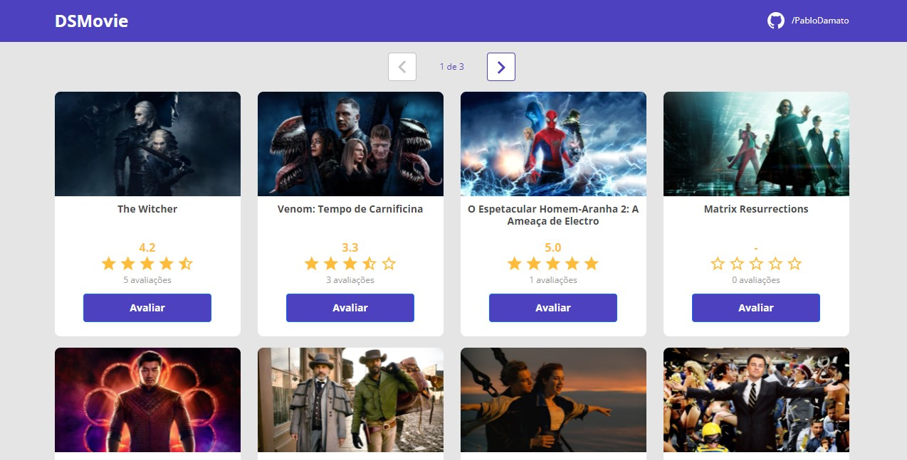
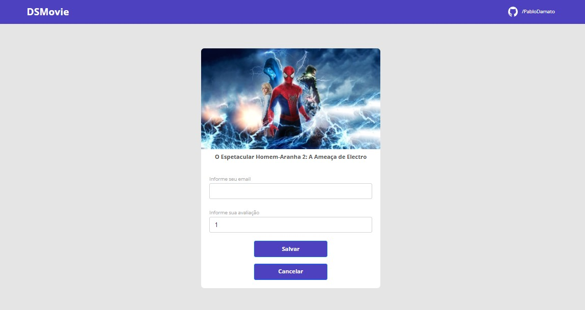

#  Semana Spring React
[](https://github.com/Socyware/dsmovie/blob/main/LICENSE) 
# Sobre o projeto
DSMovie é uma aplicação full-stack responsivo de avaliação de filmes, realizado durante a semana Spring React ministrado pelo professor [Nelio Alves](https://github.com/acenelio). Nesse projeto o usuário pode avaliar um filme do catálogo, para avaliar basta escolher um filme do catálogo e clicar no botão avaliar, você será direcionado para a página de avaliação, onde deverá informar um e-mail válido e atribuir uma nota. Na tela principal verá a qualificação do filme e a quantidade de avaliações atribuidas.<br>
O sistema na Nuvem pode ser visto pelo <a href="https://pablo-gomes-dsmovie.netlify.app/" target="_blank">link</a>.

# Layout da aplicação
<br></br>

# Tecnologias utilizadas

## Backend
* Java
* Spring Boot

## Frontend
* React
* HTML
* CSS
* TypeScript
* Bootstrap

## Implantação em produção
* Backend: Heroku
* Frontend web: Netlify
* Banco de dados: Postgresql

# Objetivos
O projeto possui objetivos, a saber:
```bash
    - Criar projetos backend e frontend
    - Salvar os projeto no Github em monorepo
    - Montar o visual estático frontend
    - Implementar o backend
    - Modelo de domínio
    - Acesso a banco de dados
    - Estruturar o back end no padrão camadas
    - Criar endpoints da API REST
    - Implantação na nuvem
    - Integrar backend e frontend
```

# Autor
<p>Pablo Silva D Amato Gomes</p>
<a href=https://www.linkedin.com/in/pablo-damato-gomes/>https://www.linkedin.com/in/pablo-damato-gomes/</a>
